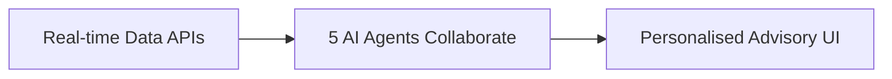
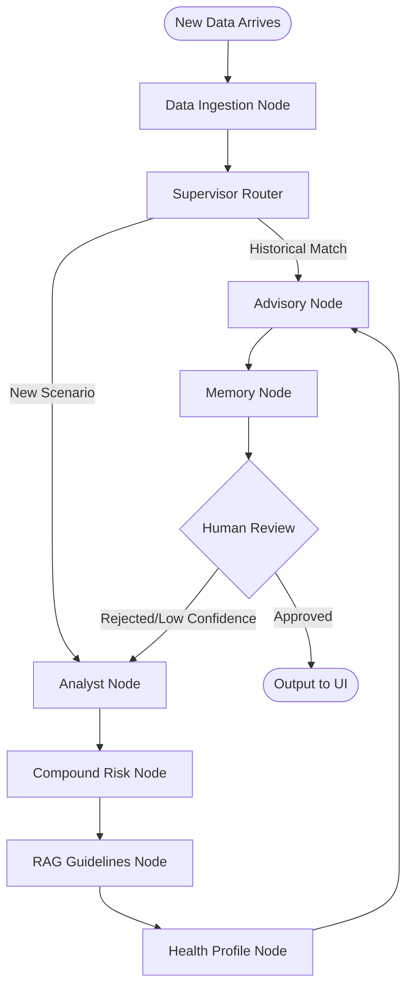

<div align="center">
  
# 🌫️ HERALD
**Hyperlocal Environmental Risk Assessment & Live Decision System**

[](https://opensource.org/licenses/MIT)
[](https://www.python.org/downloads/)
[](https://langchain-ai.github.io/langgraph/)
[](http://makeapullrequest.com)

> *A free, local, multi-agent AI system that monitors air quality and provides personalized health advice — built with LangGraph, open-source LLMs, and zero paid APIs.*

</div>

---

## 📖 Table of Contents
- [What Does HERALD Do?](#-what-does-herald-do)
- [Quick Demo](#-quick-demo)
- [How It Works](#-how-it-works)
- [Project Structure](#-project-structure)
- [System Architecture](#-system-architecture)
- [Memory Management](#-memory-management)
- [Research & Evaluation](#-research--evaluation)
- [Requirements](#-requirements)
- [Contributing](#-contributing)
- [License](#-license)

---

## 🌟 What Does HERALD Do?

HERALD continuously watches real-time pollution data for any Indian city. Using a localized team of AI agents, it reasons over the data to provide:

- **Risk Assessment**: Current air quality risk evaluated on a 1 to 5 scale.
- **Root Cause Analysis**: Explains *why* the air is risky, combining pollutants and weather factors.
- **Personalized Recommendations**: Health advice custom-tailored to conditions like asthma, elderly care, or pregnancy.
- **Outdoor Scheduling**: Intelligently predicts the best 6-hour window for outdoor activities.

Think of it as a smart, contextual air quality assistant rather than just a dashboard showing an AQI number.

---

## 📊 Features Comparison

| Feature | Existing Apps | HERALD |
| :--- | :--- | :--- |
| AQI Display | Yes | Yes |
| Pollution Forecast | Yes | Yes |
| Explanation of Pollution | No | **Yes** |
| Personalized Advice | No | **Yes** |
| Outdoor Time Suggestion | No | **Yes** |
| AI-Based System | Limited | **Advanced (Multi-Agent AI)** |
| Memory & Pattern Detection | No | **Yes** |

---

## 🚀 Quick Demo

```text
You: Check air quality in Hyderabad for an asthma patient.

HERALD: 🔴 Risk Level 4/5 — High Risk
  • PM2.5: 98 µg/m³ (WHO limit: 15)
  • Weather: Temperature inversion detected — pollutants trapped.
  • Pattern: Similar spike every Tuesday 8–11 AM.

  ✅ Recommendation for asthma patients:
  Stay indoors. Use your inhaler before any outdoor activity.
  Best window to go out: 4–6 PM today (forecast: 45 µg/m³).
```

---

## 🧠 How It Works



**The Multi-Agent Team:**

| Agent | Responsibilities |
|:---:|---|
| 📡 **Data Agent** | Fetches live AQI and weather data every 5 minutes. |
| 🔬 **Analyst Agent** | Spots anomalies and references historical pollution patterns. |
| ⚗️ **Risk Agent** | Calculates a comprehensive compound risk score (AQI + Weather + Traffic). |
| 📚 **Guidelines Agent** | Retrieves precise health rules (WHO/CPCB guidelines). |
| 📝 **Advisory Agent** | Synthesizes data into your personalized health recommendation. |

---

## 📂 Project Structure

```bash
herald/
├── agents/                  # Multi-agent specialized modules
│   ├── data_ingestion.py    # Extracts OpenAQ + Open-Meteo data
│   ├── analyst.py           # Trend and anomaly analysis
│   ├── compound_risk.py     # Calculates final risk score
│   ├── rag_guidelines.py    # RAG setup for health guidelines
│   └── advisory.py          # Final advisory generation
├── memory/                  # State and persistence layers
│   ├── faiss_store.py       # Long-term semantic episodic memory
│   └── sqlite_checkpoint.py # Short-term resilient session memory
├── state/
│   └── schema.py            # TypedDict for EnvironmentalState
├── graph/
│   └── herald_graph.py      # LangGraph node definitions & routing
├── ui/
│   └── gradio_app.py        # Web user interface
├── data/                    # Test data suites
│   ├── benchmark/           # 100 test scenarios  
│   └── synthetic/           # Offline generator  
├── evaluation/              # Scripts for thesis / evaluation
│   └── run_ablation.py      # Ablation study runner
├── requirements.txt         # Dependencies
└── README.md                # Documentation
```


## 🌐 Free APIs Used (No API Keys required)

| API Service | Data Provided | Pricing Tier |
|---|---|---|
| [OpenAQ](https://openaq.org) | Real-time PM2.5, PM10, NO2, O3 | **100% Free** |
| [Open-Meteo](https://open-meteo.com) | Live weather + 7-day future forecast | **Free, No Key** |
| [WAQI](https://waqi.info/api) | Legacy AQI for 10,000+ global cities | **Free Tier** |
| **CPCB Data** | Indian historical benchmark data | **Free Download** |

---

## 🏗️ System Architecture



*All agents modify a single, typed shared state (`EnvironmentalState`) ensuring fluid context passing.*

---

## 💾 Memory Management

1. **Short-Term Context (Session):**
   - SQLite manages graph checkpoints. If the application terminates mid-process, it reliably resumes exactly where it stopped.
2. **Long-Term Context (Cross-Session):**
   - A local **FAISS Vector Database** persists past pollution occurrences. 
   - Uses semantic similarity to immediately spot repeating patterns (e.g., *“Have we seen this pollution fingerprint in Hyderabad before?”*).

---

## 🧪 Research & Evaluation

This project includes a comprehensive ablation study toolkit specifically designed for academic publication.

```bash
python evaluation/run_ablation.py --benchmark data/benchmark/
```

**Evaluates four configurations:**
1. **A:** Full System (Multi-Agent + Memory + Tooling)
2. **B:** Amnesic System (Multi-Agent without memory)
3. **C:** Standard System (Multi-Agent without compound risk formula)
4. **D:** Monolithic (Single LLM only, no agents)

